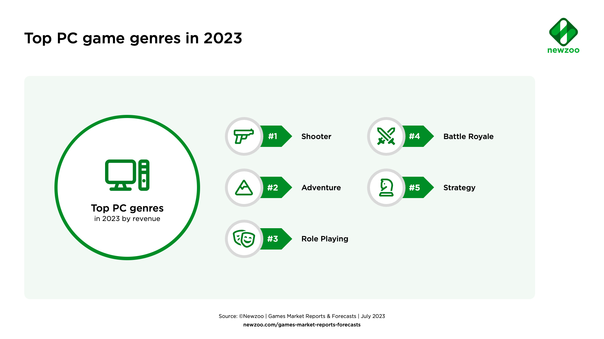
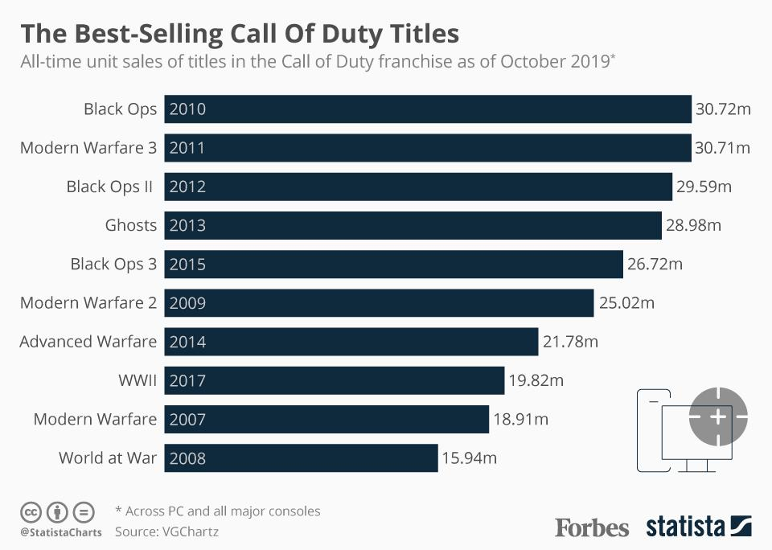
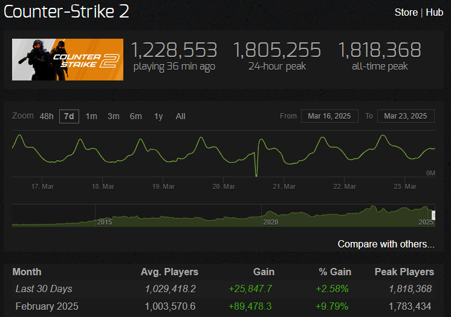
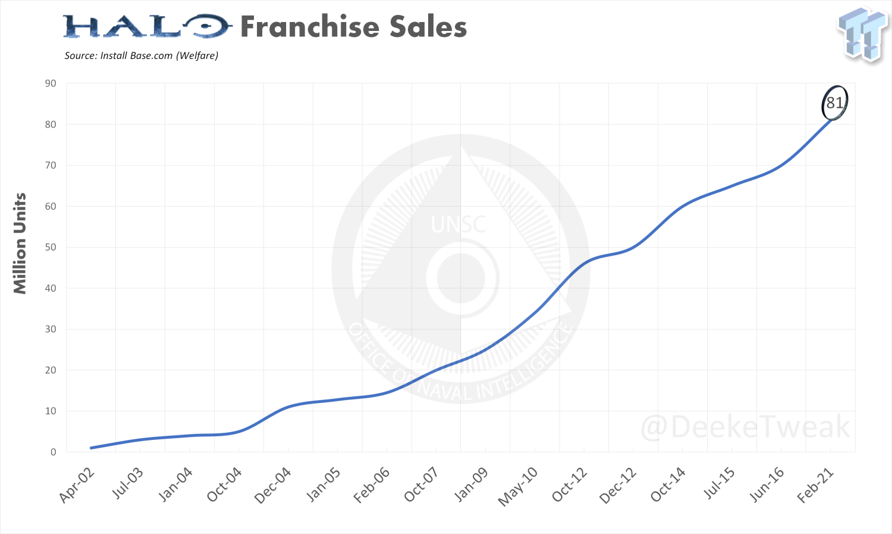

# Analýza prodejnosti FPS her
Analýza prodejnosti her, ukazuje na to, že právě FPS hry patří mezi nejprodávanější žánr her na trhu.

Mezi nejprodávanější hry tohoto žánru patří např.:

## Série Call of Duty
- Jedná se o jednu z **nejprodávanějších** herních sérií.
- Dlouhodobě dosahuje vysokých prodejů.
- Od dílu "Black Ops" z roku 2010, prodeje těchto her zpravidla přesahují 20 milionů prodaných kopií.
- Jedná se o jednu ze starších herních sérií.
- Hry série, se z pravidla stále pohybují v žebříčku nejhranějších FPS her na světě.

## Série Counter-strike
- I přestože je poslední, nejpopulárnější díl série zdarma. Série stále patří mezi nejprodávanější / nejvýdělečnější série tohoto žánru.
- Také patří mezi starší série tohoto žánru.
- Poslední díl "Counter-strike 2" dodnes překonává rekordy hratelnosti této série.
- Jedná se o **nejhratelnější** hru na Steamu.

## Série Halo
- Jedna ze starčích herních sérií.
- Série velice proslavila herní konzoli Xbox.
- Série celkově prodala více než 81 milionů kopií celosvětově.
- Jedná se o jednu z **nejvýdělečnějších** herních sérií na světě.
- Série již vydělala přes 6 miliard dolarů svými prodeji.

### Závěr
Podle těchto dat, můžeme s jistotou říci, že FPS hry patří mezi nejpopulárnější a nejvýdělečnější žánr počítačových her.
Žánr patří nejen k nejhranějším, ale zároveň navždy změnil **celý** svět počítačových her.
S neustále rostoucími technologiemi a novými způsobi pro tvorbu počítačových her, můžeme i s jistotou říci, že FPS hry v blízké budoucnosti, na popularitě rozhodně neztratí.
FPS hry vskutku změnili celý trh a rozhodně nikam nezmizí.

#### Zdroje
- [Hernimag.cz](https://www.hernimag.cz/742/nejvlivnejsi-fps-akce-na-pc-poslednich-peti-let/?utm_source=chatgpt.com)
- [Žebříčky](https://steamdb.info/charts/?tagid=1663)
- [FPS žánr](https://en.wikipedia.org/wiki/First-person_shooter#)
- [Halo](https://en.wikipedia.org/wiki/Halo_(franchise)#)
- [Counter-strike](https://en.wikipedia.org/wiki/Counter-Strike)
- [Call of Duty](https://en.wikipedia.org/wiki/Call_of_Duty)
